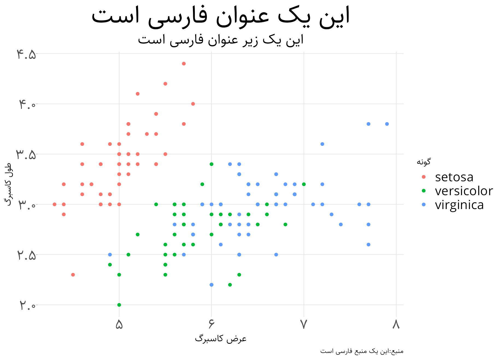

# pwrench

**Utilities for Persian/Farsi data in R** — themes, number conversion, and helpers for working with Iranian data.

---

## Overview

pwrench is a personal R package that provides:

- **Persian-friendly ggplot2 themes** (Sahel font, RTL alignment, configurable sizes)
- **Number conversion** (Persian ↔ English digits)
- **Helpers** for Iranian data (e.g. province names, churn rates)

It is primarily for personal use but may be useful for others working with Persian text and data. Use with caution; feedback and issues are welcome.

---

## Installation

```r
# install.packages("devtools")
devtools::install_github("bahmanajdari/pwrench")
```

```r
library(pwrench)
```

Requires **ggplot2** for the theme functions.

---

## Key functions

| Function | Description |
|----------|-------------|
| `theme_fa()` | Persian-friendly ggplot2 theme (title, subtitle, caption, legend; optional RTL) |
| `theme_map_fa()` | Same style for maps (minimal axes, `theme_void` base) |
| `rasmio_theme()` | Alternative Persian theme (Rasmio standards) |
| `to_en_numbers()` | Convert Persian/Arabic numerals to English (0–9) |
| `to_fa_numbers()` | Convert English numerals to Persian |
| `mutate_state_en()` | Add English province names from a column of Persian استان names |
| `calculate_churn_rate()` | Churn and retention rates by product and year |
| `psave_plot()` | Save a ggplot with consistent size and DPI |
| `detect_fake_phone_numbers()` | Flag invalid/fake phone numbers |
| `farsi_keyboard()` | Farsi keyboard–related helper |

---

## Examples

### theme_fa()

Persian-friendly plot with optional right-aligned title (RTL):

```r
library(ggplot2)
ggplot(iris, aes(x = Sepal.Length, y = Sepal.Width, color = Species)) +
  geom_point() +
  labs(
    title = "این یک عنوان فارسی است",
    subtitle = "این یک زیر عنوان فارسی است",
    x = "عرض کاسبرگ",
    y = "طول کاسبرگ",
    color = "گونه",
    caption = "منبع: این یک منبع فارسی است"
  ) +
  theme_fa()
```

Right-aligned title for RTL:

```r
theme_fa(title_hjust = 1)
```



### to_en_numbers() and to_fa_numbers()

```r
persian_number <- "۱۲۳"
to_en_numbers(persian_number)  # "123"

to_fa_numbers(123)             # Persian digits
```

### calculate_churn_rate()

Data with columns `purchase_year`, `product_id`, and `renewed` (logical):

```r
dat <- data.frame(
  purchase_year = c(2022, 2022, 2023),
  product_id = c("A", "A", "B"),
  renewed = c(TRUE, FALSE, FALSE)
)
calculate_churn_rate(dat, year = 2022:2023)
```

---

## Disclaimer

This package is primarily for personal use; public use may have limitations. Please report issues or send feedback.
